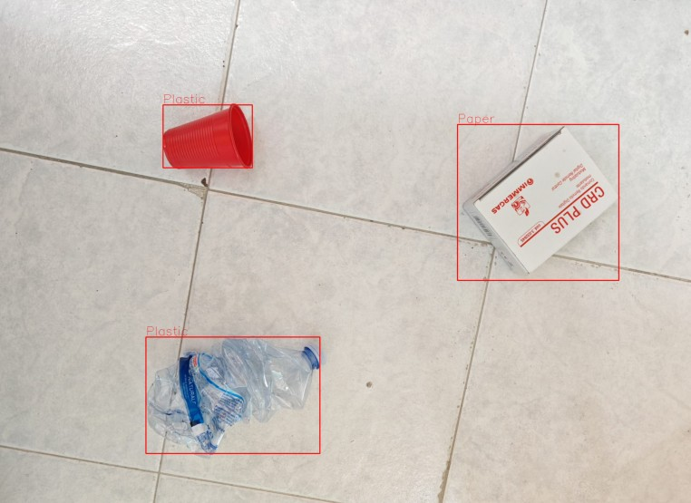

# YOLO-Waste-Detection

**YOLO-Waste-Detection** is an object-detection project built on the Ultralytics YOLOv8 framework to classify and localize five types of waste,Glass, Metal, Paper, Plastic, and Waste in images. 
Waste accumulation in urban and natural environments poses serious threats to human health, biodiversity, and climate. Computer vision offers scalable, accurate, and real-time monitoring of waste streams, enhancing recycling efficiency and supporting proactive environmental management. 

## 📂 Repository Structure

```text
├── Image/                   # Folder containing a test image
├── runs/
│   └── detect/              # YOLOv8 inference outputs
├── best_model.pt            # Best YOLO model weights
├── Waste_Detection.ipynb    # Interactive Jupyter notebook demonstrating inference & training
├── requirements.txt         # Python dependencies
├── LICENSE                  # Project license
└── README.md                # Project overview
```

## 📊 Dataset

This project leverages the publicly available “Waste Detection” dataset from [utpalpaul108/waste-detection-using-yoloV5](https://github.com/utpalpaul108/waste-detection-using-yoloV5). It contains annotated images of five types of waste.

| 📂 Attribute            | 📈 Details                                                                                           |
|-------------------------|------------------------------------------------------------------------------------------------------|
| **Number of images**    | 4127                                                                                                |
| **Splits**              | • **Train:** 3502 images <br>• **Validation:** 580 images <br>• **Test:** 45 images                  |
| **Classes**             | 5                                                                                                    |
| **Class names**         | `Glass`, `Metal`, `Paper`, `Plastic`, `Waste`                                                         |
| **Source repo**         | [utpalpaul108/waste-detection-using-yoloV5](https://github.com/utpalpaul108/waste-detection-using-yoloV5) |


## ⚙️ Project Content

### Data Handling
- Download & unzip dataset
- Explore data distribution and visualize sample images

### Model Training & Evaluation
- Train YOLOv8-nano over multiple epoch settings
- Track and select the best model based on mAP@0.5  
- Evaluate performance on validation and test sets

### Inference & Visualization
- Display predictions on test-set images  
- Test generalization on an image taken from my cell phone


## 🧪 Test 
I took a photo with my cell phone to test whether the model can correctly identify the type of waste in an image that is completely different from the ones present in the dataset used to train the model.



## 🔧 Installation

```bash
git clone https://github.com/gianlucasposito/YOLO-Waste-Detection.git    
cd Waste_Detection
pip install -r requirements.txt
```

## 🚮 Simulated "Throwing Waste" Detection

`throwing_waste_detector.py` adds a third detection type, "Throwing Waste,"
alongside the waste and smoking detectors. It's **simulated**: there's no
model behind it yet, it just reads a JSON file that says which video and
timestamp to "detect" at, and produces the same kind of artifacts a real
detector would (a snapshot, a logged event, an email alert).

### How it works

1. **Drop videos in.** Either upload a video from the dashboard's Throwing
   Waste tab (saved into `uploads/videos/` via `POST /throwing-waste/upload`,
   accepts `.mp4`/`.avi`/`.mov`/`.mkv`/`.webm`), or copy files directly into
   `uploads/videos/` (created automatically, git-ignored). The tab lists
   currently uploaded videos so you know what names are available to
   reference.
2. **Point the JSON at them.** Edit `data/throwing_waste_events.json` —
   one entry per video, each with a list of `HH:MM:SS` timestamps to
   simulate a detection at:
   ```json
   [
     {
       "video_name": "video1.mp4",
       "detections": [
         { "timestamp": "00:00:12" },
         { "timestamp": "00:01:45" }
       ]
     }
   ]
   ```
3. **Run the fake detector**, either from the CLI:
   ```bash
   python throwing_waste_detector.py
   ```
   or via the "Run Detector" button on the dashboard's Throwing Waste tab
   (`POST /throwing-waste/run`).

   For each timestamp, it uses `ffmpeg` (must be installed and on `PATH`)
   to extract a snapshot frame from the matching video, saves it to
   `static/outputs/throwing_waste_snapshots/`, appends the event to
   `data/throwing_waste_log.json`, and emails the snapshot via
   `email_notifier.py`.
4. **See results on the dashboard.** Start the app (`python app.py`),
   open the Throwing Waste tab, and click Refresh (or Run Detector) to
   list every logged detection — video name, timestamp, snapshot
   thumbnail (click for full size), and when it was logged — sorted most
   recent first.

### Email notifications

Copy `.env.example` to `.env` and fill in real SMTP credentials (Gmail
works with an app password from Google Account > Security > App
passwords). `.env` is git-ignored; never commit real credentials. If the
env vars aren't set, the detector still runs and logs events, it just
skips sending email.

```
EMAIL_ADDRESS=your-email@gmail.com
EMAIL_APP_PASSWORD=your-16-char-app-password
SMTP_SERVER=smtp.gmail.com
SMTP_PORT=587
RECEIVER_EMAIL=recipient@example.com
```
